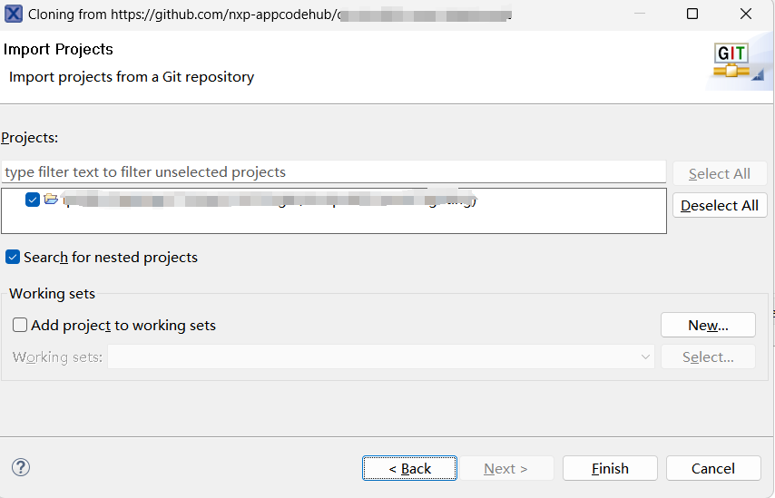

# NXP Application Code Hub

## usb-to-multi-vcom-on-mcxc444
This application note describes how to implement a USB to multiple VCOMs' functions on MCXC444 series on FRDM boards (FRDM-MCXC444). The function of USB to VCOM can be implemented by using the common AT commands in the subclass of the abstract control model in the CDC class specified by the USB protocol. A USB device can support one or more VCOMs, the number of VCOM depends mainly on the number of endpoints (EP) supported by USB device. This application note implements the function of a USB to 15 VCOMs and the development tool is MCUXpresso IDE

#### Boards: FRDM-MCXC444
#### Categories: Industrial
#### Peripherals: USB
#### Toolchains: MCUXpresso IDE

## Table of Contents
1. [Software](#step1)
2. [Hardware](#step2)
3. [Setup](#step3)
4. [Results](#step4)
5. [FAQs](#step5) 
6. [Support](#step6)
7. [Release Notes](#step7)

## 1. Software
- Download and install [MCUXpresso IDE V11.9.0 or later](https://nxp.flexnetoperations.com/control/frse/download?agree=Accept&element=3595113).
- MCUXpresso for Visual Studio Code: This example supports MCUXpresso for Visual Studio Code, for more information about how to use Visual Studio Code please refer [here](https://www.nxp.com/design/training/getting-started-with-mcuxpresso-for-visual-studio-code:TIP-GETTING-STARTED-WITH-MCUXPRESSO-FOR-VS-CODE).
- Make sure that you are already familiar with SDK original examples, such as hello_world and dev_composite_cdc_vcom_cdc_vcom_lite_bm example.

## 2. Hardware
* FRDM-MCXC444

  
* Personal Computer
* 2 x USB type-C cable

## 3. Setup
1. Connect the FRDM-MCXC444 development board to your computer using a USB cable.
2. Ensure the development board is recognized correctly.

### 3.1 Step 1

1. Open MCUXpresso IDE, in the Quick Start Panel, choose **Import from Application Code Hub**    

	

2. Enter the demo name in the search bar.   

	

3. Click **Copy GitHub link**, MCUXpresso IDE will automatically retrieve project attributes, then click **Next>**.   

	

4. Select **main** branch and then click **Next>**, Select the MCUXpresso project, click **Finish** button to complete import.   

	
	

### Step 2 (Hardware Setup)

* Compile the project and use a TypeC-USB cable to connect to the FRDM board via MCU-LINK connector. Use MCU-LINK to download program into MCU. 
* Connect Another TypeC-USB cable with MCU_USB Port with PC. 

### Step 3 (Running The Demo)

Press SW1 on FRDM board to reset the board to let the code running.

## 4. Results
Open the “Device Manager” on Windows PC. totally 16 VCOM port will be created as below figure shows:

## 5. FAQs
No FAQ currently

## 6. Support
- For additional information and support, visit NXP's official website:

#### Project Metadata
<!----- Boards ----->

<!----- Categories ----->

<!----- Peripherals ----->

<!----- Toolchains ----->

Questions regarding the content/correctness of this example can be entered as Issues within this GitHub repository.

>**Warning**: For more general technical questions regarding NXP Microcontrollers and the difference in expected funcionality, enter your questions on the [NXP Community Forum](https://community.nxp.com/)

## 7. Release Notes
| Version | Description / Update                           | Date                        |
|:-------:|------------------------------------------------|----------------------------:|
| 1.0     | Initial release on Application Code Hub        | May 15th 2024 |

